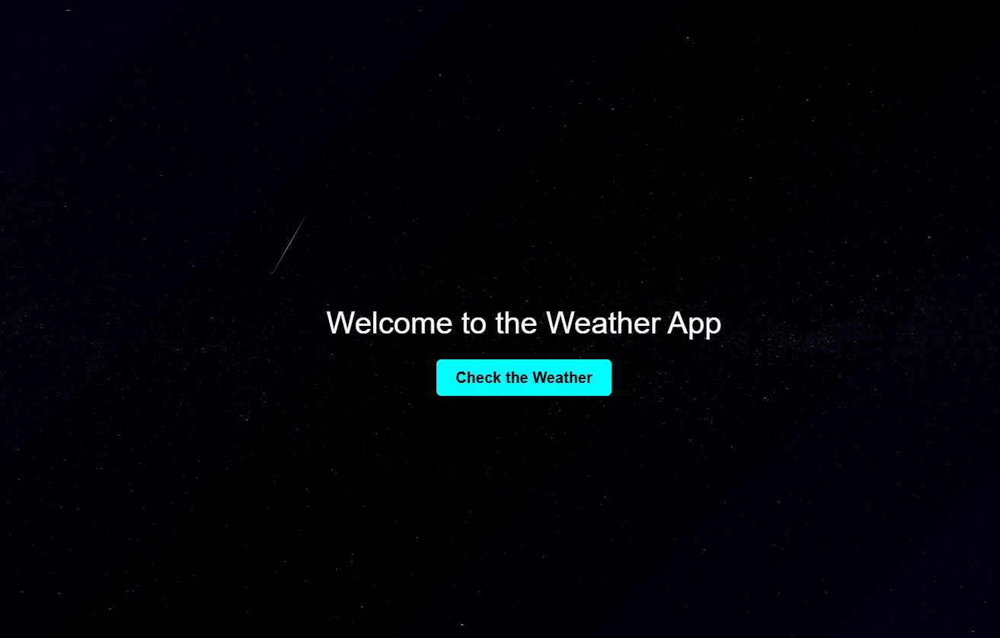

# 🌌 Sci-Fi Weather App with Shooting Stars 🌠

A futuristic **weather application** with a stunning **sci-fi background**, twinkling stars, and dynamic **shooting stars animations**. Built using **Flask, HTML, CSS, and JavaScript**.
<p align="center">
  
</p>

---

## 🚀 Features
✔ **Real-time Weather Data** – Get live weather updates for any city 🌍  
✔ **Gradient Sci-Fi Background** – Black, violet, and navy blue for a futuristic look 🌌  
✔ **Twinkling Starry Sky** – A deep-space background with animated stars ✨  
✔ **Shooting Stars Effect** – Realistic meteor showers every few seconds 🌠  
✔ **Fully Responsive** – Works on all devices 📱💻  

---

## 🛠 Tech Stack
- **Frontend:** HTML, CSS (Animations, Gradients)  
- **Backend:** Python (Flask)  
- **API:** OpenWeatherMap (for live weather data)  

---

## 📥 Installation & Setup

### 1️⃣ Clone the Repository
```sh
git clone https://github.com/your-username/weather-app.git
cd weather-app
```

### 2️⃣ Create & Activate a Virtual Environment
```sh
python -m venv venv
```
- **Windows:**  
  ```sh
  venv\Scripts\activate
  ```
- **Mac/Linux:**  
  ```sh
  source venv/bin/activate
  ```

### 3️⃣ Install Dependencies
```sh
pip install -r requirements.txt
```

### 4️⃣ Run the Flask App
```sh
python app.py
```
or  
```sh
flask run
```
- Open **`http://127.0.0.1:5000/`** in your browser. 🌍  

---

## 🎨 UI Enhancements

### 🌌 Sci-Fi Background
```css
body {
    background: linear-gradient(135deg, rgb(31, 9, 204), black, rgb(60, 4, 227));
}
```

### ✨ Twinkling Stars
```css
.stars {
    background: url('https://www.solarsystemscope.com/textures/download/2k_stars.jpg');
    animation: twinkle 5s infinite alternate;
}
```

### 🌠 Shooting Stars Animation
```css
.shooting-stars::before {
    content: "";
    width: 3px;
    height: 80px;
    background: linear-gradient(transparent, white, transparent);
    animation: shootingStar 4s infinite linear;
}
```

---

## 🛠 API Setup

1. **Get an API key** from [OpenWeatherMap](https://openweathermap.org/api).  
2. **Create a `.env` file** and add:  
   ```ini
   API_KEY=your_api_key_here
   ```
---

## 📌 To-Do (Future Enhancements)

✅ Improve UI with **Glassmorphism** 🪟  
✅ Add **Dark Mode Toggle** 🌑  
✅ Use **WebGL for more immersive effects** 🔥  

---

## 👨‍💻 Author

💡 Made with ❤️ by **Sabhya**  

🌟 **If you like this project, don’t forget to star ⭐ the repo!**  

---


